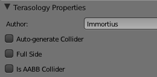

# Introduction

Terasology has a easy-to-edit shape format for blocks allowing anyone, with a small amount of learning, to create new block shapes that can be easily used in the game. While the block shape format _is_ hand editable and you _could_ write a block shape by hand, there is a great addon for the free, open source 3d editor Blender ([Blender's Home](https://www.blender.org)) that allows you to easily create block shapes in a visual WYSIWYG environment and export them for use in Terasology.

## Get set up: Installing the Terasology Block Shape Addon

* Download blender. Blender 2.60 was used when developing the addon so _should_ be guaranteed to work. Blender version 2.61 and 2.62 should also work, but anything newer (2.63 and up) will not.
* Download the Terasology project. You could obtain this as described on the [[Dev Setup]] page. Alternatively, you can download the full source straight from github. This is recommended, if you are not going to get set up as described in [[Dev Setup]], as it contains all the current shapes to inspect and all of the currently used textures. As a last option, you could download the addon manually from  https://github.com/MovingBlocks/Terasology/tree/develop/blender_addons.
* Install the Blender addon. In Terasologies project, you will find a directory called 'blender_addons', with a sub directory called 'io_mesh_terasology'. Copy this entire directory into `[your blender install directory]/[your blender version]/scripts/addons` (typically something like `C:\Program Files\Blender Foundation\Blender\2.60\scripts\addons`). 
* Enable the addon in Blender. Start Blender, and open the user preferences page (under the File menu). On the Addons tab find the "Import-Export: Terasology Block Shape Export" addon (which you can easily do using the search bar on the left side of the window) and activate it by checking the box on the right. You will then want to save the user preferences so that the addon stays enabled after you close Blender and then restart. Otherwise, you will have to re-enable the addon every time you start up Blender.

## Fundamentals

A block shape in blender is a set of mesh objects corresponding to the various parts of the block shape. For each side and the center part of the block shape, a mesh object with the corresponding name can be present: Top, Bottom, Left, Right, Front, Back and Center. Additionally, extra mesh objects can be used to define the collision bounds for the block shape.

When creating a block shape, you need to keep the following in mind:
* Blocks should be created centered on the origin
* A standard block is half the scale of a new Blender cube
* Blender axes are different from Terasology's axes, and instead, correspond as follows:

**Block Sub-piece in Terasology** / **Direction in Blender**
* Center 
* Top / +Z axis
* Bottom / -Z axis
* Front / -Y axis
* Back / +Y axis
* Left / +X axis
* Right / -X axis

## Tips When Creating A Shape

* To avoid problems later in the creation process, scale in Edit Mode instead of Object Mode.
* When UV mapping, you should map against a single 16x16 texture.
* To preview your shapes texture after unwrapping, you can switch a 3d view in Blender to Textured shading. Additionally, having mipmapping turned off will give a display very similar to what you will see in-game. To disable mipmapping:
    * Go to the user preferences (File menu).
    * In the user preferences window, go to the 'System' tab.
    * In the middle near the top you should find a checked option that says 'Mipmaps'. Uncheck this.

## Terasology Exporter Addon Properties

The Terasology Block Shape addon adds two panes to the 3d view properties side panel in Blender. 

The first pane, Terasology Scene Properties, contains settings that are universal (not based on what mesh you have selected):
* Author - Your name here
* Collision Type
* Is Collision Symmetric - Is collection unchanged if the block is rotated? If checked, then definitions using this shape will not have a block generated for each rotation.
* Use Billboard Normals - For flat, vertical billboards, this causes the normals to point upwards so they are lit correctly by sunlight.

The second pane, Terasology Mesh Properties, contains settings that apply to the currently selected mesh object:
* Full Side - Does this side fill the block's space - this will cause the side of blocks facing it not to be rendered.
* Collider Type

Example properties screen (may be outdated):

## Related Links and Resources

* [[Shape Architecture]]
* [[German Tutorial|http://terasologyblog.de/2012/08/tutorial-erstellen-eines-json-blockes]]
* [Youtube series covering block shape creation in Blender](http://www.youtube.com/watch?v=BM219wj0v6Y)