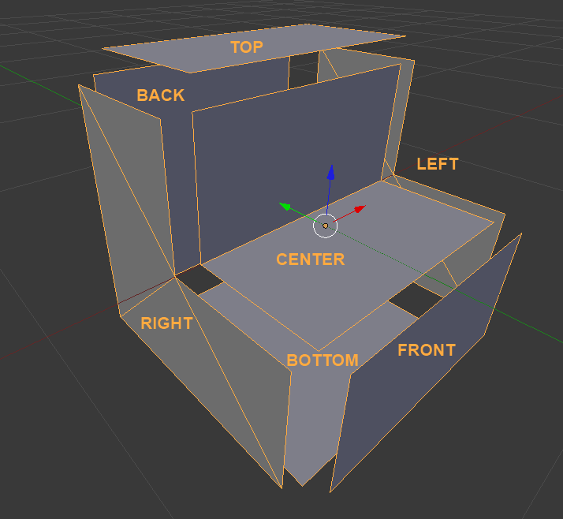

This is a guide to how Block Shapes work in Terasology

# Block Shape Basics

A block shape defines a way a block can look - its shape. Each block shape can be used by multiple blocks, each applying a different texture to it. Each shape is composed of *up to* 7 parts

* The center mesh, which is always rendered if present (visible). This is typically used for parts of the block contained *within* the area of the block.
* Six side meshes - one for each direction. These are only rendered if the side is not obscured.

Additionally, each side is either a full side or a partial side. A full side fills the entire side of the block, and so obscures the sides of adjacent blocks. A partial side does not. For instance, if the side is against a dirt cube, then it cannot be seen a player so need not be rendered.

Below is an example stair block shape, with each side moved away from the center. In the stair block, the Front and Bottom sides are full sides, while the Top, Back, Left and Right sides are not.

## Shape part

Surrounds the shape definition. Contains one or more Mesh Part blocks, which may be named Center, Top, Bottom, Left, Right, Front or Back. These correspond to each of the direction, and the central mesh as follows

<table>
    <tr>
        <td>*Sub-block*</td>
        <td>*Direction*</td>
    </tr>
    <tr>
        <td>Center</td>
        <td>-</td>
    </tr>
    <tr>
        <td>Top</td>
        <td>+Y axis</td>
    </tr>
    <tr>
        <td>Bottom</td>
        <td>-Y axis</td>
    </tr>
    <tr>
        <td>Front</td>
        <td>-Z axis</td>
    </tr>
    <tr>
        <td>Back</td>
        <td>+Z axis</td>
    </tr>
    <tr>
        <td>Left</td>
        <td>-X axis</td>
    </tr>
    <tr>
        <td>Right</td>
        <td>+X axis</td>
    </tr>
</table>

Generally the front of the block is the side you expect to face towards the player when they are placing it - the front of stairs, or the lit part of a torch.

A standard block is centered on the origin, with each side 0.5 units away in the appropriate direction.

Additionally a Shape may contain a Colliders section, if it wishes to have a collision shape other than the full block. Stairs, for instance, have two colliders - one for the bottom step and one for the top

## Mesh Part

Each mesh part block contains the following components:

* vertices - a list of 3D vectors that make up the mesh part
* normals - a list of normals corresponding to the vertices
* texCoords - the texture coordinates corresponding to the vertices
* faces - one or more lists of indices corresponding to vertices, each of which forms a polygon that comporises the mesh part.
* fullSide - a boolean denoting whether a side obscures all adjacent sides or not - basically whether it is a square the fills that side of the cube. This isn't used by the center mesh part, and if not specified defaults to false.

## Colliders

The colliders section lists one or more Axis-Aligned Boxes that define collision for the shape. Axis aligned means the sides of the box are always at right angles to the primary axes.

Each collider has two properties:

* position - where the collider is centered
* extents - how far away each corner of the box is along each axis.

## Related Links

   * [[Block Shapes In Blender]]
