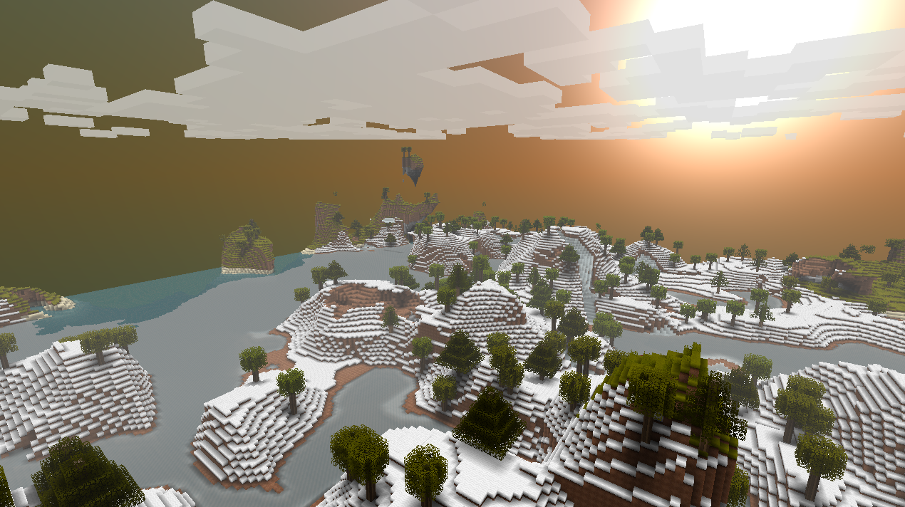

Biomes define the properties of the different regions in Terasology. They are calculated using two distinct multifractal noise functions simulating changes in humidity and temperature. Biomes vary in various factors like, for example, the maximum height of the terrain (and thus the intensity of overhangs created), the populated fauna elements, grass color, foliage color and the types of blocks the terrain is made of.

## Biome types

There are currently five different types of biomes available in the game.

### Plains
The Plains biome can be found in areas with medium to high temperature (&gt; 0.5) and low to high humidity (0.3 &lt; humidity &lt; 0.8). The overall terrain is very flat with almost no hills or overhangs and allows the generation of rivers. It is populated with a large amount of high grass and some sole trees here and there. In hotter regions cacti can be found instead of trees.

### Forest
The Forest biome is currently filling the regions where no other biome is available and its terrain is defined by smooth hills and small overhangs. It is populated by many trees and grass and allows the generation of rivers.

### Mountains
Mountains can be found in areas with medium temperature (0.3 &lt;= temperature &lt; 0.6) and low humidity (&lt; 0.4) and terrain is defined by large mountains and enormous overhangs. It's populated with some trees and a large amount of grass.

### Desert
The Desert biome is generated in areas with high temperature (&gt;= 0.6) and low humidity (&lt; 0.3). The terrain is defined by some smooth hills including overhangs and the upper layer consists only of sand blocks. The region is populated by some cacti.

### Snow
The Snow biome can be found in regions with low temperature (&lt; 0.3) and low humidity (&lt; 0.4). The surface is covered with snow blocks and some sole trees.

## Generation Example
An image representing a random generation of biomes.

* Forest = green
* Mountains = red
* Desert = yellow
* Plains = blue
* Snow = white

	 	
